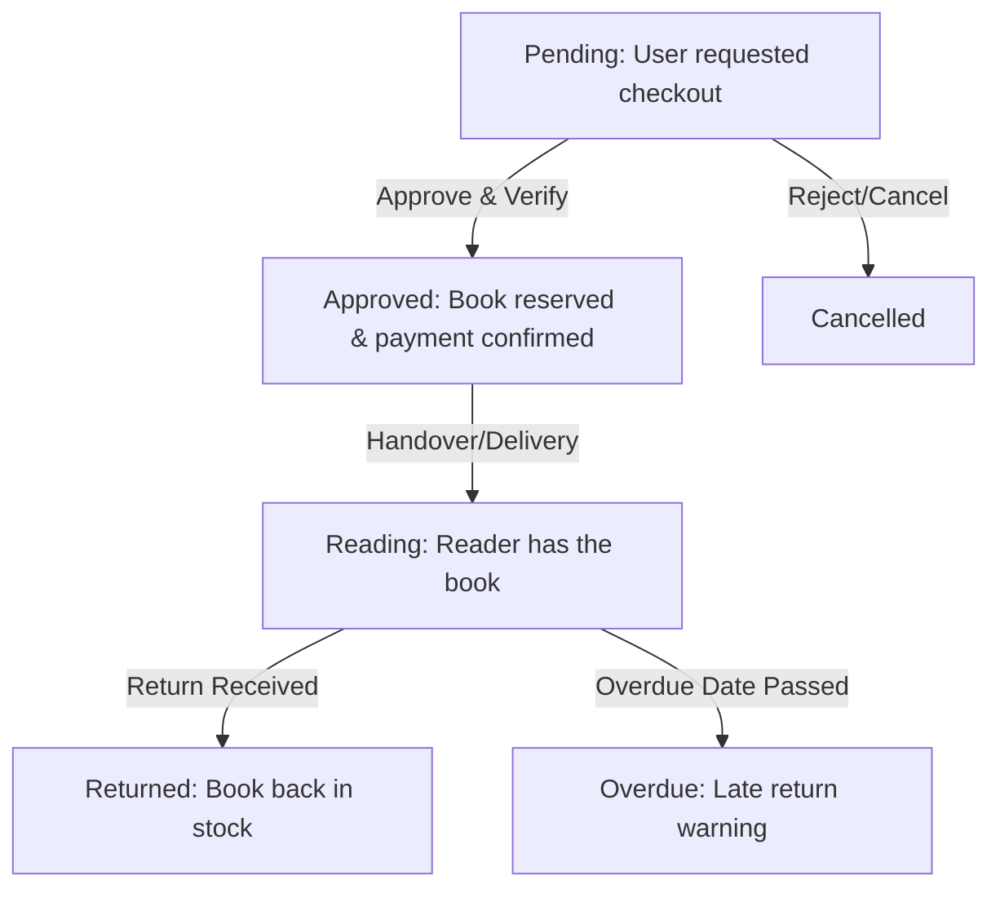

# Next Door Library — Administrator Manual

Welcome to the **Next Door Library** admin guide. This document explains how to access the administration portal and manage the platform's inventory, physical hubs, rentals, members, and support requests.

---

## 1. Accessing the Admin Portal

### Credentials
*   **Admin Sign-in URL**: Navigate to the standard login page at `https://nextdoorlibrary.in/login` (or `/login` on your localhost).
*   **Default Admin Email**: `admin@nextdoorlibrary.in`
*   **Default Admin Password**: `adminpassword123`

*Upon successful login with an administrator account, the system automatically redirects you to the `/admin` dashboard.*

---

## 2. Admin Dashboard Overview
The main admin dashboard provides a quick summary of the platform's current health and operations:
*   **Active Rentals**: Number of books currently out on loan with readers.
*   **Pending Requests**: New checkout requests waiting for your approval.
*   **Total Inventory**: Total number of book titles in the catalogue.
*   **Registered Members**: Total number of readers in the community.
*   **Active Hubs**: Number of physical pickup/drop-off locations.

---

## 3. Inventory & Books Management
Located in the **Books** tab, this is where you control the books catalogue.

### Adding a New Book
1.  Click the **Add New Book** button.
2.  Fill in the details:
    *   **Title**: The name of the book.
    *   **Author**: The writer's name.
    *   **Genre**: Select from standard genres (Fiction, Self-Help, Mystery, Romance, etc.).
    *   **Rental Price**: Weekly rental price (standard rate is between ₹15 to ₹30 per week).
    *   **Total Copies**: The total quantity of this book owned by the library.
    *   **Condition**: Select the physical condition (New, Good, Fair).
    *   **Synopsis**: A brief description/blurb of the book.
3.  **Cover Image Upload**: (See details below).
4.  Click **Save / Add Book**.

### Updating Cover Images
*   **During Upload/Edit**: Inside the Book form, you can upload an image file (JPEG/PNG) directly from your computer.
*   **Image Processing**: The server automatically processes the image, saves it in the secure `/uploads/` static directory on the server, and saves the relative link in the database.
*   **Best Practice**: Use portrait-oriented images with a standard aspect ratio (e.g., 3:4 or 2:3) and a resolution of at least 400x600 pixels to ensure they look premium in the browser grids.

### Editing & Deleting Books
*   **Editing**: Click the **Edit (pencil icon)** on any book row to update its weekly price, total copies, condition description, or upload a new cover image.
*   **Availability Calculation**: The system dynamically calculates available copies: `Available = Total Copies - Active Loans`.
*   **Deleting**: Click the **Delete** button to remove a title from the library catalog. (Note: Only delete books that do not have active active rentals).

---

## 4. Hubs & Pickup Locations Management
Physical pickup spots are managed in the **Hubs** section. These locations are shown to readers during checkout when they select "Self Pickup".

### Managing Hubs
*   **Add Hub**: Click **Add Hub** and enter:
    *   **Hub Name**: E.g., "Dharampeth Library Corner".
    *   **Full Address**: The physical address of the hub.
    *   **Working Hours**: The open hours (e.g., "Mon-Sat: 10 AM - 7 PM").
    *   **Contact Number**: Phone number for local coordinates.
*   **Edit Hub**: Update locations, timing adjustments, or phone numbers.
*   **Delete Hub**: Remove a hub if it is no longer operational.

---

## 5. Rentals & Checkout Requests Flow
When a user requests a book, it appears in the **Rentals** tab. To move a rental request through its lifecycle, use the **Quick Actions** status transition buttons:

### Rental Status Lifecycle

### Action Controls:
1.  **Pending**: A reader has requested a book. 
    *   Verify the checkout details and payment method.
    *   Click **Approve** (marks it as **Approved**). This reserves the copy.
2.  **Approved**: The book is ready.
    *   Upon hand-off (Self-pickup) or shipping (Home Delivery), click **Mark Out** (marks it as **Reading / Active**).
3.  **Active**: The reader currently has the book.
    *   The system monitors the due date. If the return date passes without action, it shows an **Overdue** flag.
4.  **Returned**: When the reader returns the book, click **Mark Returned**. 
    *   This automatically increments the book's `availableCopies` count by 1 in the inventory so other readers can check it out!
5.  **Cancelled**: If a payment fails or a reader cancels, click **Cancel Request**.

---

## 6. Registered Members Management
The **Users** tab displays a list of registered platform members.

*   **Member Cards**: View their name, email, profile bio, and total books read.
*   **Contact Information**: Displays their verified phone number and email coordinates (e.g., to follow up on late book returns).
*   **Role Management**: Standard readers have the role `user`. You can view administrator accounts (role `admin`) here as well.

---

## 7. Customer Support Ticket Desk
When readers submit support inquiries through their dashboard, they appear in the **Support Tickets** desk.

*   **Reviewing Tickets**: View the subject summary, categorized issue type (Payment, Delivery, Account, Other), and detailed description.
*   **Resolution Process**:
    1.  Read the member's contact email.
    2.  Send support updates or coordinate directly via the primary email channel: **`admin@nextdoorlibrary.in`**.
    3.  Once resolved, mark the ticket complete.
